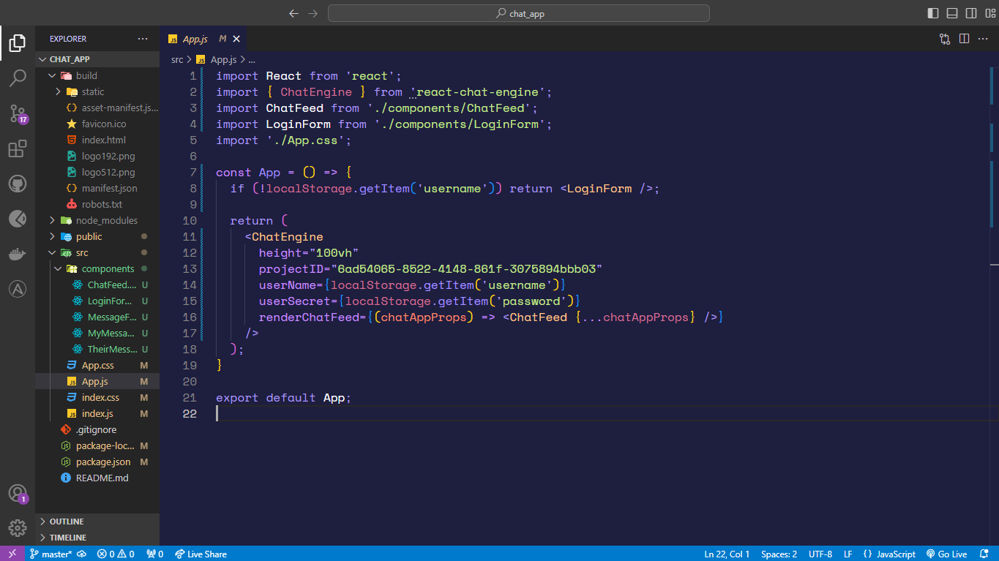

# Nayan Theme

Nayan Theme is a versatile and developer-centric Visual Studio Code theme extension, crafted to provide a range of thoughtfully designed themes for different coding environments. Each theme is optimized for various lighting conditions, ensuring an accessible and personalized coding experience. Whether you're coding in a bright space or a dark room, Nayan Theme has you covered, offering visually cohesive designs that enhance focus and reduce eye strain.

# Nayan Purple Theme

## Themes Included

- **Nayan Dark**: A sophisticated dark theme, providing the perfect balance for coding in low-light environments, designed to minimize eye fatigue during long coding sessions.
- **Nayan Light**: A high-contrast, clean theme, ideal for daylight coding or well-lit environments, offering crisp readability without being harsh on the eyes.
- **Nayan Blue**: A cool, calming blue theme with a dark background that encourages relaxation while maintaining focus during long work hours.
- **Nayan Green**: A refreshing green-accented theme that brings a natural and vibrant feel to your coding environment, making it visually stimulating and pleasant.
- **Nayan Purple**: A vibrant and energetic purple theme that combines strong contrast with bold colors to enhance readability and provide an enjoyable coding experience.
- **Nayan Orange**: A warm theme with rich orange highlights that provides a stylish yet functional design, ideal for a productive and engaging atmosphere.

## Features

- **Accessibility**: The themes are designed with high contrast and colorblind-friendly options to ensure inclusivity for all users.
- **User-Friendly Design**: Each theme is optimized for clarity and readability, allowing developers to code comfortably for extended periods.
- **Modern Aesthetic**: The themes offer a sleek, visually appealing design that maintains usability while enhancing the overall coding experience.

## Installation

1. **Install from the Marketplace**:
   - Download and install the Nayan Theme from the Visual Studio Code Marketplace by clicking the link below:
   
     [Get Nayan Theme on the VS Code Marketplace](https://marketplace.visualstudio.com/items?itemName=NayanDas.nayan-theme)
     
   - Alternatively, search for "Nayan Theme" in the Visual Studio Code Extensions Marketplace and click install.

## How to Use

Once installed, go to the Command Palette (`Ctrl+Shift+P`) and type "Color Theme". From there, select your preferred Nayan theme:
- `Nayan Dark`
- `Nayan Light`
- `Nayan Blue`
- `Nayan Green`
- `Nayan Purple`
- `Nayan Orange`

## Changelog

See the [CHANGELOG](CHANGELOG.md) for details on new features, changes, and bug fixes.

## Issues and Contributions

We welcome contributions! If you find bugs or want to enhance the theme, feel free to open issues or submit pull requests. Your feedback is invaluable!

- GitHub Repository: [Nayan Theme GitHub Repo](https://github.com/nayandas69/nayan-theme)
- Report Issues: [Submit Issues Here](https://github.com/nayandas69/nayan-theme/issues)

---